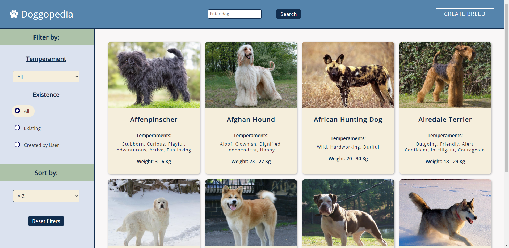
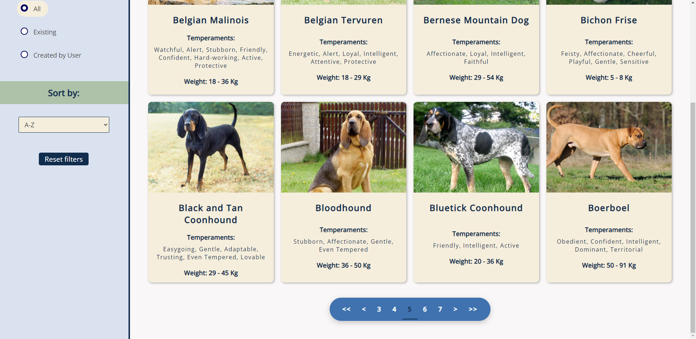
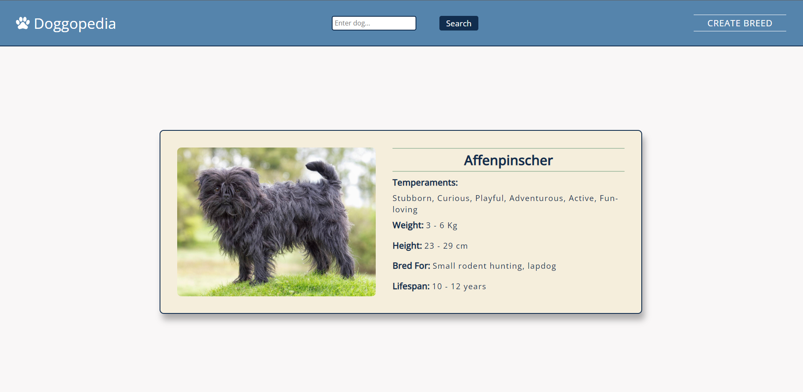
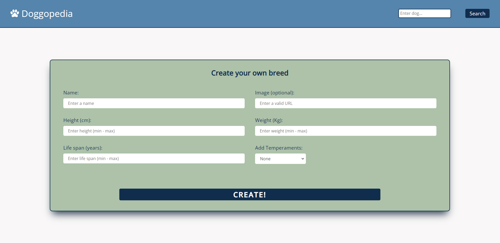

<p align='left'>
    
</p>

# Individual Project - Doggopedia

<p align="left">
  
</p>

## Description

The idea was to create a SPA (single page application) where information about different dog breeds is displayed
using an external api [the dog api](https://thedogapi.com/) and be able to:

- Search for dogs
- Filter and Sort
- Add new dogs

## Technologies used:

- [ ] React
- [ ] Redux
- [ ] React-Router
- [ ] Styled Components
- [ ] Node
- [ ] Express
- [ ] Sequelize - PostgreSQL

## Installation

```
git clone https://github.com/MontiMarco92/PI-Doggopedia.git
npm install >> PI-Doggopedia/api/
npm start
npm install >> PI-Doggopedia/client/
npm start
```

## Previews

<p align='left'>
   </img>
</p>
<p align='left'>
  </img>
</p>
<p align='left'>
  </img>
</p>
<p align='left'>
  </img>
</p>
<p align='left'>
  </img>
</p>
